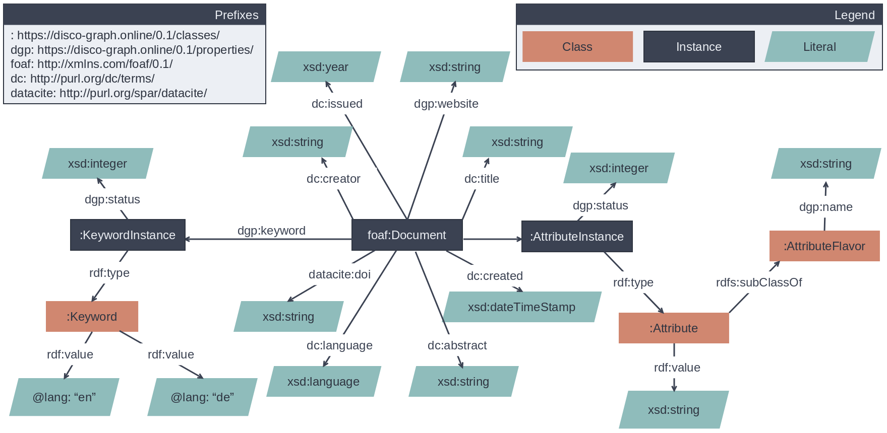

# disco graph
Knowledge graph powered information discovery based on keyword associations.

## WIP
This project is just starting out. Documentation will come once the dust of starting out settles.

The disco graph application consists of three major components: The Knowledge Graph, the Backend services and the 
Frontend. A short description of these components is given in the following paragraphs:

### Knowledge Graph
The Knowledge Graph is the heart of Disco Graph, as it serves as main data-structure containing the relationships
between Publications, Keywords and further information. This datastructure allows for efficient retrieval of relevant
information. The Knowledge Graph is accessed through the Backend. The Knowledge Graph consists of RDF triples that are
stored in an [Apache Jena Fuseki SPARQL Server](https://jena.apache.org/documentation/fuseki2/). The general structure
is shown in this schematic depiction:

### Frontend
The Frontend allows users to discover the knowledge hidden in the knowledge graph. It combines features to search, view
and edit information about publications and provides an interface for managing users and roles through the admin portal.

The Frontend is a webapp based on the [Angular Framework](https://angular.io/), using the [Angular Material component 
library](https://material.angular.io/).

### Backend
