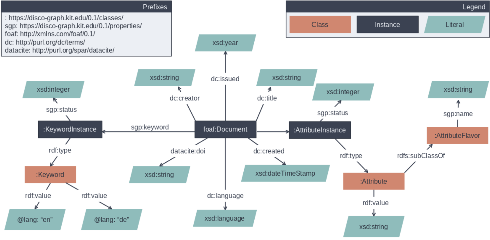

# Knowledge Graph

**Table of contents:**
1. [Overview](#1-overview)
   1. [Schema](#11-schema)
      1. [Keywords](#111-keywords)
      2. [Additional Attributes](#112-additional-attributes)
2. [Code](#2-code)

## 1. Overview
The Knowledge Graph is based on the [Apache Jena Fuseki](https://jena.apache.org/documentation/fuseki2/) SPARQL server.
As such it interacted with through the [SPARQL Query Language](https://www.w3.org/TR/rdf-sparql-query/). The server itself
is schema-agnostic, meaning the data-schema is solely defined by the user. In disco-graph the interaction with the server
is done exclusively via the graph-connector, which makes sure that all queries are well-formed and comply with the defined
schema.

### 1.1. Schema

The schema revolves around publications that are represented as documents with a number of attributes. Each publication is
associated with any number of keywords and so-called additional attributes.
### 1.1.1 Keywords
Each keyword of a publication is associated with a publication-specific keyword instance. This keyword instance has a status
attribute that is used to track whether users confirm how fitting the keyword association is, and a keyword as type. This
keyword type that represents a language independent representation of a keyword that is associated with any number of keyword
instances of different publications.
### 1.1.2 Additional Attributes
Additional Attributes are placeholders for custom attributes associated with publications. Their schema shares similarities
with the schema of keywords, as there are also attribute instances with a verification status that are of an Attribute type.
Additionally, the Attribute type is subclass of an so-called Attribute Flavor which describes the context of the Attribute.\
For example associating the research group responsible for a publication as additional attribute would mean that there is
an Attribute Flavor "Group", which has Attribute types as subclasses representing the specific different research groups.

 

## 2. Code
Since disco-graph uses the Fuseki project as it is, the only code is the deployment code found in the 
[deploy/docker/fuseki directory](../../deploy/docker/fuseki). This folder contains the Dockerfile used to build the docker 
image and the docker-compose.yml file used to control the deployment.