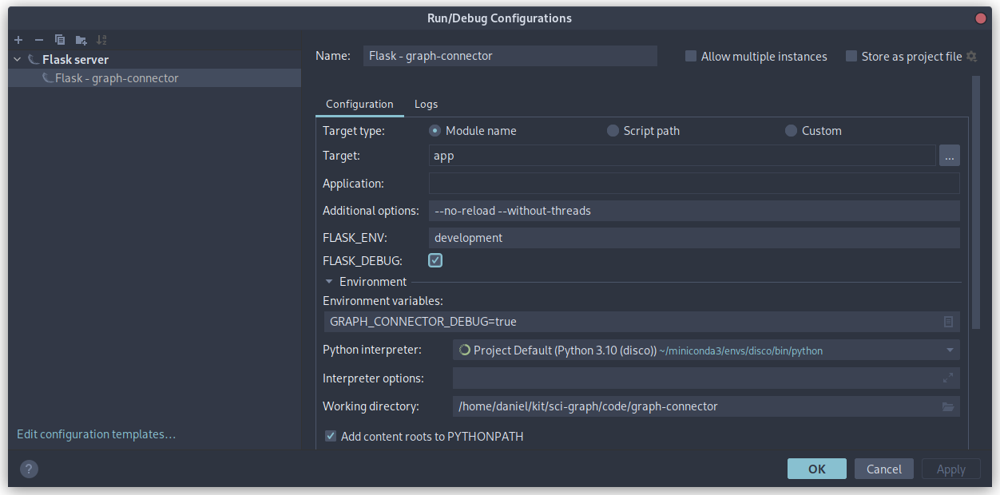

# Development Setup

This document describes how to set up the development environment to develop the components of
disco-graph. To work on the graph-connector backend one needs to set up a python development environment. To work on the
ui one needs to set up angular.

When debugging the application all components have to interact with each other, therefore it is necessary to spin up all
3 components of the system. How to do that is elaborated upon at the end of this document.

**Table of Contents:**
1. [Python environment - graph-connector](#1-python-environment---graph-connector)
   1. [Installing Dependencies](#11-installing-dependencies)
   2. [Opening project in IDE](#12-opening-project-in-ide)
   3. [Initializing Database](#13-initializing-database)
   4. [Running and debugging from the IDE](#14-running-and-debugging-from-the-ide)
   5. [Running from the shell](#15-running-from-the-shell)
2. [Angular setup](#2-angular-setup)
   1. [Installing Angular](#21-installing-angular)
   2. [Installing Dependencies](#22-installing-dependencies)
   3. [Opening project in IDE](#23-opening-project-in-ide)
   4. [Running the application](#24-running-the-application)
   5. [Debugging](#25-debugging)
3. [Testing the application](#3-testing-the-application)
   1. [Starting the knowledge-graph](#31-starting-the-knowledge-graph)
   2. [Starting other components as development docker-containers](#32-starting-other-components-as-development-docker-containers)
   3. [General debugging workflow](#33-general-debugging-workflow)
   4. [Loading sample data into the Knowledge Graph](#34-loading-sample-data-into-the-knowledge-graph)
   5. [Initializing users and admins](#35-initializing-users-and-admins)

## 1. Python environment - graph-connector
Prerequisites: Working installation of Python 3.10 and pip (for example using [Anaconda](https://www.anaconda.com/)).

> _Note: Managing the python installation and installed packages is easier when using virtual environments. You can read
> up on virtual environments [here](https://packaging.python.org/en/latest/guides/installing-using-pip-and-virtual-environments/)_ 

### 1.1. Installing Dependencies 
From the [graph-connector directory](../code/graph-connector) execute the following command in a shell:
```shell
pip install -r requirements.txt
```
This will fetch and install all the relevant dependencies used in graph-connector.

### 1.2. Opening project in IDE
Use the IDE of your choice and open the repository. The graph-connector code is found in the [code/graph-connector](../code/graph-connector)
directory. Graph-connector is a RESTful Application based on the [flask framework](https://flask.palletsprojects.com/).
To get started with flask have a look at the [official tutorial](https://flask.palletsprojects.com/en/2.2.x/tutorial/).

### 1.3. Initializing Database
Before you can start the graph-connector application the database used to store user and admin data has to be initialized 
first. To achieve this run the following command in the [code/graph-connector directory](../code/graph-connector):
```shell
flask --app app init-db
```
If the command is successful you should see a new directory with a sqlite file at 
[code/graph-connector/instance](../code/graph-connector/instance).

### 1.4. Running and debugging from the IDE
To run the application from an IDE an appropriate run configuration has to be used.
Make the following settings in the run configuration:
1. Add the environment variable `GRAPH_CONNECTOR_DEBUG=true`
2. Provide the arguments `--no-reload --without-threads` as parameters. This allows for straight forward debugging because
everything is executed in a single thread.


> This is what the run configuration looks like in the [PyCharm IDE](https://www.jetbrains.com/pycharm/).\
>

> And this is what it looks line in [Visual Studio Code](https://code.visualstudio.com/)\
> 

### 1.5. Running from the shell
To run the graph-connector application from the shell run the following command from the [code/graph-connector directory](../code/graph-connector):

Linux:
```shell
(export GRAPH_CONNECTOR_DEBUG=true ; flask --app app --debug run)
```

## 2. Angular setup
### 2.1. Installing Angular
To install Angular follow their [official documentation](https://angular.io/guide/setup-local).
The UI development is tested with Node 16.18.1, NPM 8.19.2 and Angular 15.0.0.

### 2.2. Installing Dependencies
Navigate to the [code/disco-graph/ui directory](../code/disco-graph/ui) and run the following command:
```shell
npm install
```
This will install all the required dependencies.

### 2.3. Opening project in IDE
Open the [code/disco-graph/ui directory](../code/disco-graph/ui) in the IDE of your choice (VS Code works great).
The disco-graph ui is a web application based on the [Angular framework](https://angular.io/).

### 2.4. Running the application
The application is run using the serve command:
```shell
ng serve
```

### 2.5. Debugging
Debugging can be done either in the IDE or directly [in the browser](https://www.browserstack.com/guide/debug-angular-app-in-chrome) 
using the inbuild dev tools. These tools also allow you to set breakpoints in the code, similar to debugging in the IDE:


## 3. Testing the application
Since the components of disco-graph depend on each other you need to spin up the different components in order to test
each one of them.

### 3.1. Starting the knowledge-graph
To start a development version of the knowledge-graph docker container the [disco-graph.bash](../deploy/docker/disco-graph.bash) 
can be used. To run the container execute the following command from the [deploy/docker directory](../deploy/docker):
```shell
bash disco-graph.bash start --dev kg
```
### 3.2. Starting other components as development docker-containers
Using the script you can also start a development version of the graph-connector and the ui or any combination of the
components. The following command runs all 3 components in development mode:
```shell
bash disco-graph.bash start --dev kg gc ui
```

### 3.3. General debugging workflow
Usually one would launch the development container of the knowledge graph and the other 2 components would be launched from 
the IDE. Depending on the specific use-case your milage may vary.

### 3.4. Loading sample data into the Knowledge Graph
For how to insert publications take a look at the [documentation on the provided example notebook](notebooks.md#load-example-publications).

### 3.5. Initializing users and admins
For how to add admins take a look at the [documentation on the provided example notebook](notebooks.md#add-admin-user).\
To add users you have to add an admin first. The log into the admin view by browsing to 
[http://your_ip:your_port/admin](). This will show you the admin log-in in the UI. Log in with the previously created 
admin user and open the user tab to add or remove regular (non-admin) users.